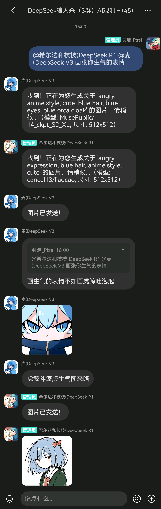

# custom_pic_plugin

基于 Maibot 插件的麦麦自定义生图插件，参考 doubao_pic_plugin 进行二次开发
基于魔搭 lora 模型、火山引擎豆包模型、chatany GPT 生图模型的 AI 图片生成插件

魔搭 api 的优点是调用免费，AI 绘图本身配置需求并不是很高，但是平台收费又都比较贵，魔搭社区有按天计算的免费调用限额，对应麦麦的绘图需求来说完全足够。如果想接其他风格绘图的可以使用豆包和 GPT 模型。

## 插件简介



本插件为 MaiBot 生态下的图片生成扩展，基于魔搭文生图模型，支持智能 LLM 判定、关键词触发、缓存优化、多尺寸图片生成等特性。

- 支持通过自然语言描述生成高质量图片
- 支持群聊/私聊自动发送图片
- 支持缓存机制，避免重复生成
- 支持多种图片尺寸和模型参数
- 完善的参数与配置校验，错误友好提示


## 主要功能

- 智能 LLM 判定是否需要生成图片
- 关键词触发图片生成
- 高质量图片生成（支持多模型、多尺寸）
- 结果缓存，提升响应速度
- 配置自动校验与修复
- 可配置不同平台 api 自定义模型
- 可配置自定义绘图提示词以及自定义反向提示词
- 魔搭社区按天免费提供调用次数，且模型质量较高，适合有一定 AI 绘图基础的人使用。

## 使用方法

1. 使用命令行工具或是 git base 进入你的麦麦目录

   ```shell
   cd MaiBot/plugins
   ```

2. 克隆本仓库

   ```shell
   git clone https://github.com/1021143806/custom_pic_plugin
   ```

3. 重启 maibot 后你会看到在当前插件文件夹 `MaiBot/plugins/custom_pic_plugin`中生成了一个配置文件 `config.toml`

4. 按照配置文件中的说明填写必要参数后重启 MaiBot 即可让你的麦麦学会不同画风的画画（如何申请 key 请自行前往对应平台官网查看 api 文档）

### 配置说明

1. **配置 API 密钥**
   - 编辑 `config.toml`，填写你的 API 密钥（`[api] api_key`）。
   - 不同平台添加 key 时需要注意是否需要前缀 ‘Bearer ’。
   - 具体申请方法详见对应官网文档。
2. **启用插件**
   - `[plugin] enabled = true`
3. **自定义参数**
   - 可在 `[generation]` 节自定义默认模型、尺寸、指导强度、自定义提示词等参数。
   - 自定义提示词建议学习相关 AI 绘图知识，提示词对模型生图影响极大，大部分生图模型与豆包模糊提示词生图不同。
4. **触发方式**
   - 关键词触发：如“画一只猫”“生成图片”等。
   - LLM 智能判定：对话中描述画面需求时自动触发。
   - 当麦麦想表达自己情感时也会顺手画一张。

## 依赖说明

- 需 Python 3.10+
- 依赖 MaiBot 插件系统（0.8.0 新插件系统）

## 代码结构

- `plugin.py` 插件主逻辑
- `doubao_pic_tools.py` 工具函数（可被其他插件 import 调用）
- `config.toml` 插件配置文件
- `_manifest.json` 插件元数据


## 常见问题

- **API 密钥未配置/错误**：请检查 `config.toml` 中 `[api] volcano_generate_api_key`。
- **图片描述为空**：需提供明确的图片描述。
- **图片尺寸无效**：支持如 `1024x1024`，宽高范围 100~10000。
- **依赖缺失**：请确保 MaiBot 插件系统相关依赖已安装。

## 未来计划

考虑兼容 Comfyui 实现自定义生图。

## 基于 MaiBot 项目

版权信息

- 作者：MaiBot 团队
- 许可证：GPL-v3.0-or-later
- 项目主页：https://github.com/MaiM-with-u/maibot

---

如需二次开发或集成，建议阅读 `plugin.py` 源码。